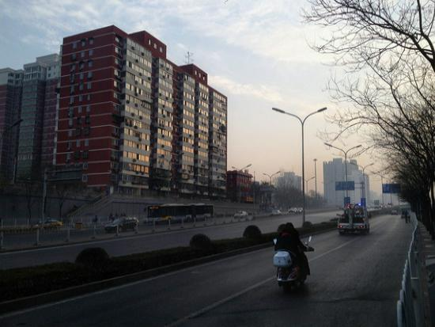
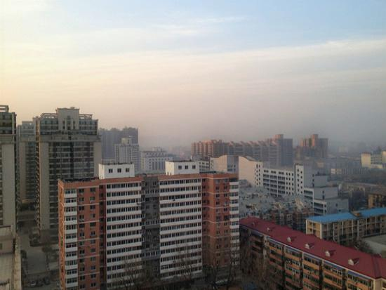
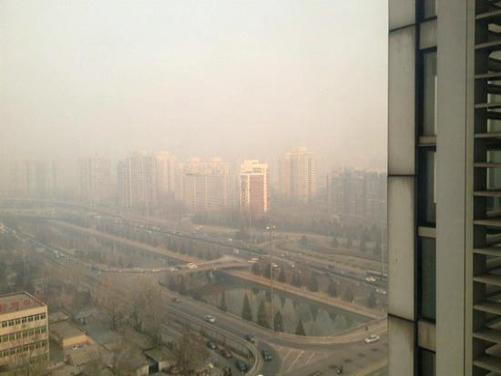
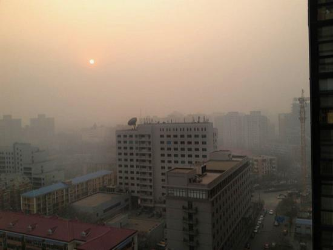

# RDDN
This repo contains the official training and testing codes for our research.

## Prerequisites
- Python >= 3.7
- Torch >= 1.6.1
- Torchvision = 0.8.2 
- Pillow >= 5.1.0  
- Numpy >= 1.14.3

## Introduction
- ```train.py``` and ```test.py``` are the entry codes for training and testing the RDDN.
- ```train_data.py``` and ```val_data.py``` are used to load the training and validation/testing datasets.
```residual_dense_block.py``` builds the [RDB](https://arxiv.org/abs/1802.08797) block.
- ```perceptual.py``` defines the network for [Perceptual Loss](https://arxiv.org/abs/1603.08155).
- ```utils.py``` contains all corresponding utilities.
- ```./checkpoints/10_[3,5,7,9]_24/best_psnr.pth``` is the trained weights for outdoor in SOTS from [RESIDE](https://sites.google.com/view/reside-dehaze-datasets/reside-v0?authuser=0), where 10 stand for the number of epochs and [3,5,7,9] are milestones. 

## Quick Start

### 1. Testing

```bash
$ git clone https://github.com/Haakon68/RDDN.git
$ cd RDDN
```
Run ```test.py``` using default hyper-parameter settings. 
```bash
$ python test.py
```
If you want to change the default settings (e.g. modifying the ```batchSize``` since you have multiple GPUs), simply run

```bash
$ python test.py -batchSize 32
```
It is exactly the same way to modify any other hyper-parameters as shown above. For more details about the meaning of each hyper-parameter, please run

```bash
$ python test.py -h
```

### 2. Training
To retrain or fine-tune the RDDN, first download the OTS (for outdoor) training datasets from [RESIDE](https://sites.google.com/view/reside-dehaze-datasets/reside-v0?authuser=0).

Then, copy ```hazy``` and ```clear``` folders from downloaded OTS to ```./data/train/``` and ```./data/test/```.

If you hope to use your own training dataset, please follow the same folder structure in ```./data/train/```. More details can be found in ```train_data.py```.

After putting the training dataset into the correct path, we can train the RDDN by simply running ```train.py``` using default settings.

```bash
$ python train.py
```

### Demonstration
Only listed several examples, more results can be found in my [github](https://github.com/Haakon68/RDDN).
<table>
	<tr>
		<th>Hazy</th>
		<th>Groundtruth</th>
		<th>Our result</th>	
	</tr>
	<tr>
		<th></th>		
		<th></th>
		<th></th>
	</tr>
	<tr>
		<th></th>		
		<th></th>
		<th></th>
	</tr>
	<tr>
		<th></th>		
		<th></th>
		<th></th>
	</tr>
	<tr>
		<th></th>		
		<th></th>
		<th></th>
	</tr>

</table>
